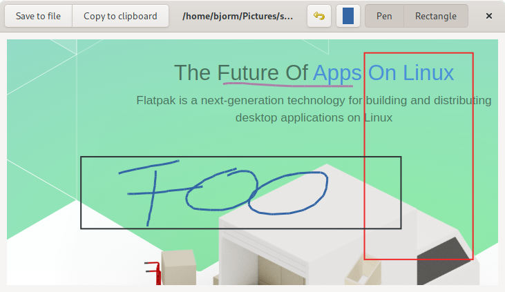

# Scrann - Screenshot annotator

Simple screenshot grabber with annotation capabilities.

<a href="screenshot.png">
    
</a>

## How to install
Requirements:
    
- Gnome 3.38
- Flatpak

1. clone repo
2. run `./local-install.sh`

## How to run
After installing Scrann should appear in your Gnome application menus.

If you want to run it via command line, do
```shell
flatpak run io.github.bjorm.scrann
```

## To-do
- crop tool
- smooth pen
- text tool
